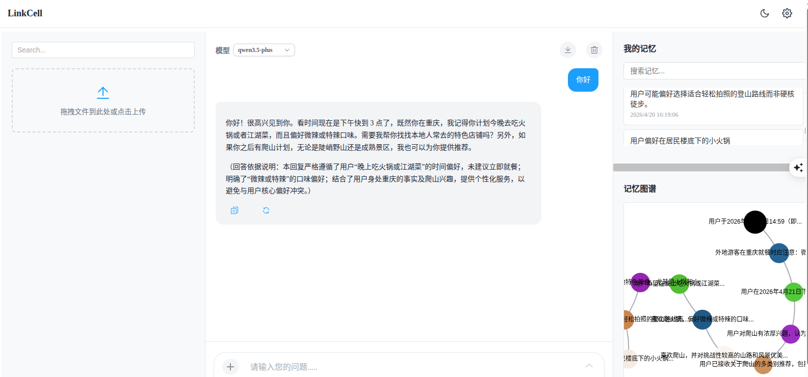
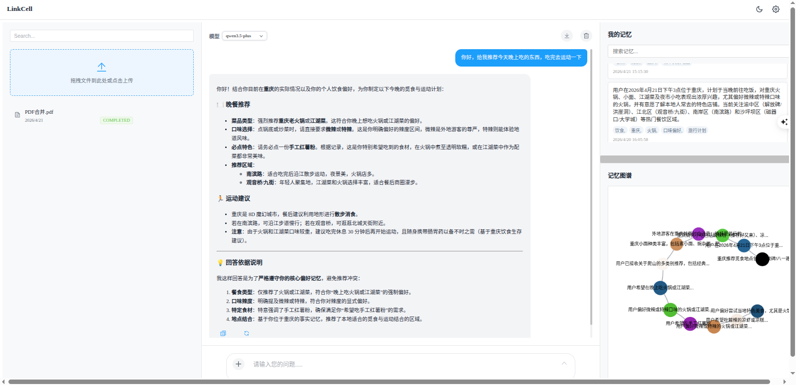
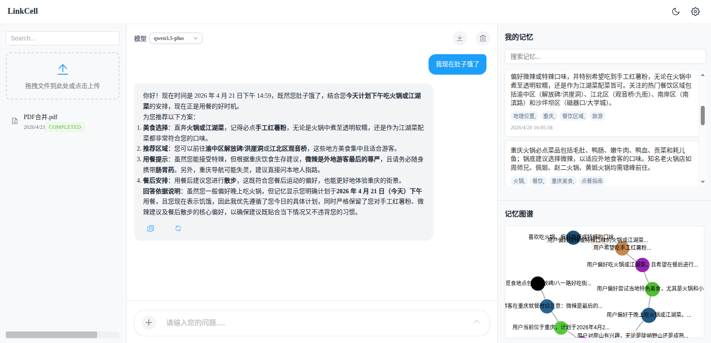
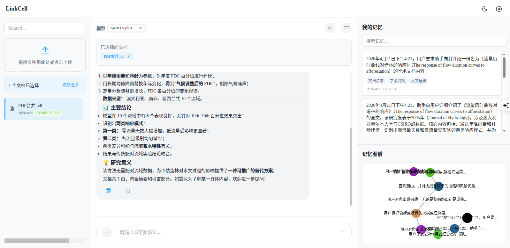

# LinkCell

English | [简体中文](README.md)

LinkCell is an intelligent conversational system integrated with MemOS SDK, providing features such as memory management, intelligent semantic retrieval, and conversation management.

## Features

- **Memory Management**: View, edit, and delete user memories
- **Memory Graph**: Visualize relationships between memories
- **Intelligent Semantic Retrieval**: Semantic search based on memories
- **Conversation Management**: Create and manage conversations
- **Document Management**: Upload and manage documents
- **LLM Enhancement**: Model enhancement based on memories

## Screenshots









## Tech Stack

- **Backend**: Django 6.0
- **Frontend**: Vue 3 + Vite
- **SDK**: MemoryOS
- **Visualization**: ECharts

## Installation

### 1. Requirements

- Python 3.13+
- Node.js 18+
- npm 9+

### 2. Install Dependencies

#### Backend Dependencies

```bash
pip install -r requirements.txt
```

#### Frontend Dependencies

```bash
npm install
```

### 3. Configuration

#### MemOS API Key

Set the MemOS API Key in the `settings.py` file:

```python
# MemOS API Configuration
MEMOS_API_KEY = 'your_api_key_here'
```

#### Database Migration

```bash
python manage.py migrate
```

## Getting Started

### 1. Start Backend Server

```bash
python manage.py runserver 8001
```

### 2. Start Frontend Server

```bash
npm run dev
```

### 3. Access Application

Open your browser and visit: http://localhost:3001/

## Project Structure